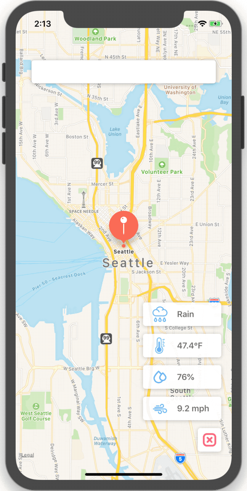
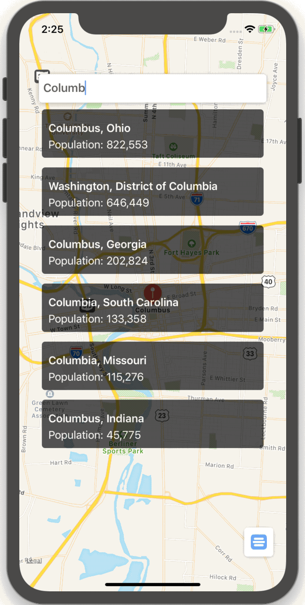

# :sunny: :umbrella: City2City :cloud: :snowflake:

## Overview
**City2City** is a simple iOS app leveraging **Open Weather API** to pull live weather information about major U.S. cities

      


## Development
**City2City** was developed in `Swift 5.0` and uses Apple's framework `MapKit`, `MKAnnotation`, as well as `CoreLocation` to pin cities to Apple's interactive map


## API
Live weather information are pulled directly from the **Open Weather API**.
To get a free **Open Weather API** `API key` and implement it in your application click [here](https://openweathermap.org/appid)


## Usage
City2City uses a private Open Weather API key not provided in this repository, as a result running this project without another `api key` will **not** work. To fix this, simpy get a new `api key` from [Open Weather](https://openweathermap.org/appid) and replace `API.KEY.OPEN_WEATHER` in `Constant.swift` with that new key

```swift
// MARK: - Variable(s)

struct ENDPOINT {

    struct WEATHER {
    
        static let BASE = "https://api.openweathermap.org/data/2.5/weather"
        static let DEFAULT = "\(ENDPOINT.WEATHER.BASE)?APPID=\(YOUR_NEW_API_KEY)&units=imperial"
    }
}
```


## Other
Copyright © 2019 Jonathan Sack
